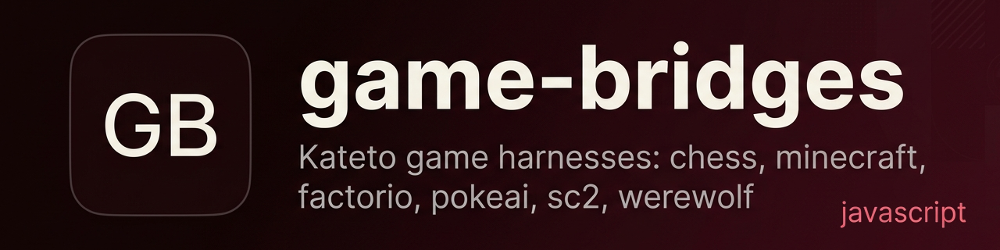
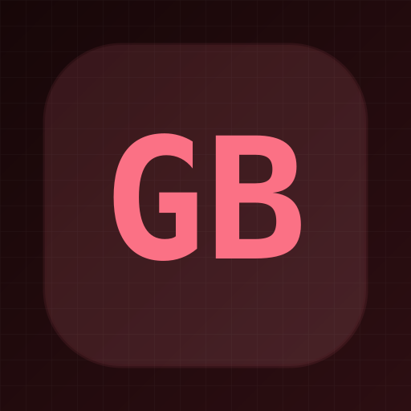

<p align="center">
  
</p>

<h1 align="center">game-bridges</h1>

<p align="center"><b>Game harnesses that bridge chess, Minecraft, Factorio, Pokémon, StarCraft 2, and Werewolf to a shared Kateto event bus for LLM agent control.</b></p>

<p align="center">
  
  
  
  
</p>

---

## Qué es

Cada carpeta (`chess-hs/`, `factorio/`, `minecraft-voyager/`, `pokeai/`, `sc2/`, `werewolf/`) contiene un **harness** Python que conecta un juego específico al event bus de Kateto. El harness envía el estado del juego, recibe decisiones de agentes LLM (Jane, Doktor, Conquest) y ejecuta las acciones en el motor del juego.

**En una frase:** Conectores de juego para que agentes LLM autónomos puedan jugar, planificar y comentar partidas en tiempo real.

## Estado

| | |
|---|---|
| **Estado** | prototipo |
| **Última actividad** | 2026-09 |
| **Se puede usar hoy** | sí, en modo mock sin juego instalado; modo real requiere ROMs (Pokémon), SC2 + Wine (StarCraft 2), o Factorio con mod ai-player-v3 |
| **Lo que falta** | adaptadores completos para Factorio/SC2/Minecraft (parches stub), integración real con Kateto overlay WS, tests unitarios |
| **Riesgos / deuda conocida** | algunos harnesses usan polling como fallback cuando WS no responde; el modo real de SC2 y Factorio necesita configuración específica del juego |

## Por qué existe

Parte del proyecto Kateto: agentes LLM que operan en entornos de juego reales con memoria persistente (MemPalace), overlay visual para OBS, y coordinación multi-agente (voces con roles distintos). Cada juego necesita un adaptador que traduzca entre el motor del juego y el event bus.

## Demo

Cada harness corre standalone con `--mock`:

```bash
cd chess-hs && uv run harness.py --mock --rounds 1
```

En modo mock, los harnesses generan eventos al bridge sin necesidad del juego. En modo real, se conectan al juego y ejecutan acciones reales.

## Instalación y uso

Requisitos: Python 3.14+, [uv](https://github.com/astral-sh/uv), Kateto bridge corriendo en `localhost:8099`.

```bash
git clone https://github.com/Gonanf/game-bridges.git
cd game-bridges

# Chess (parches: python-chess, websockets, httpx)
cd chess-hs && uv sync && uv run harness.py --mock

# Factorio (requiere mod ai-player-v3 en el juego)
cd factorio && uv sync && uv run harness.py --mock

# Minecraft (requiere Mineflayer/bot.js)
cd minecraft-voyager && uv sync && uv run harness.py --mock

# Pokémon GB/GBC (requiere ROM en roms/pokemon_red.gb)
cd pokeai && uv sync && uv run harness.py --mock
# Pokémon GBA
uv run harness.py --rom ~/ROMs/pokemon_fireRed.gba

# StarCraft 2 (requiere SC2 + Wine + LLM-PySC2)
cd sc2 && uv sync && uv run harness.py --mock

# Werewolf (juego de cartas/arena con 7 agentes)
cd werewolf && uv sync && uv run harness.py --mock
```

```bash
# Ejemplo: chess contra el bridge real
cd chess-hs && uv run harness.py --bridge http://127.0.0.1:8099
```

## Stack

- **Lenguaje / runtime:** Python 3.14+ (uv-managed)
- **Dependencias principales:** httpx, python-chess, websockets, PyBoy (Pokémon), PyGBA/mgba (GBA)
- **Infra / servicios:** Kateto bridge (event bus HTTP + WS), OBS overlay
- **Lo que NO usa:** No usa frameworks de agentes (LangChain, etc.) — los harnesses son conectores puros; la inteligencia vive en el bridge.

## Arquitectura

```
Juego → Harness → POST /api/game/event → Kateto Bridge → Agentes LLM (Jane/Doktor/Conquest)
                                  ↑                                   ↓
                            GET /api/game/state ← Tool Calls ← Resolución
                                  ↓
                            Harness → Ejecuta acción en el juego
```

Cada harness sigue el mismo patrón:
1. **`post()`** — envía eventos al bridge (estado, movimientos, texto)
2. **`*_loop()`** — ciclo principal: lee estado, pide decisión al bridge, ejecuta
3. **`--mock`** — bypass del bridge, genera eventos de ejemplo

Las **voces** (Jane, Doktor, Conquest) son agentes LLM con roles:
- **Jane** — planning / análisis
- **Doktor** — ejecución / movimiento
- **Conquest** — juez / crítico

## Estructura del repo

```
chess-hs/        # Ajedrez: python-chess + render SVG/HTML
factorio/        # Factorio: adaptador RCON + mod ai-player-v3
minecraft-voyager/ # Minecraft: Mineflayer bot.js + adaptador Kateto
pokeai/          # Pokémon GB/GBA: PyBoy/PyGBA + 3 agentes (plan/exec/critique)
sc2/             # StarCraft 2: LLM-PySC2 + adaptador Wine
werewolf/        # Werewolf Arena: 7 agentes, debate + votos
docs/            # Documentación extendida
SPEC.md          # Arquitectura completa del sistema Kateto
```

## Roadmap

- [ ] Adaptadores Factorio y SC2 completos (actualmente stubs)
- [ ] Integración WS directa con Kateto overlay (reemplazar polling)
- [ ] Tests unitarios para harnesses
- [ ] Werewolf: sistema de turnos con moderador real
- [ ] Chess: modo turn-based interactivo (no solo auto-play)

## Notas y decisiones

- Cada juego es un directorio independiente con su propio `pyproject.toml` — no hay dependencias cruzadas.
- El bridge (`localhost:8099`) es un componente externo (Kateto). Este repo solo contiene los harnesses.
- Los adaptadores de juego (factorio_adapter.py, minecraft_adapter.py, etc.) son stubs que simulan el estado real. La integración completa depende de cada motor de juego.
- El SPEC.md describe la arquitectura completa con perfiles de juego, system prompts, y coordinación multi-agente.

## Licencia

Privado — sin licencia explícita no es open source, es código visible.

---

<p align="center">
  
</p>
